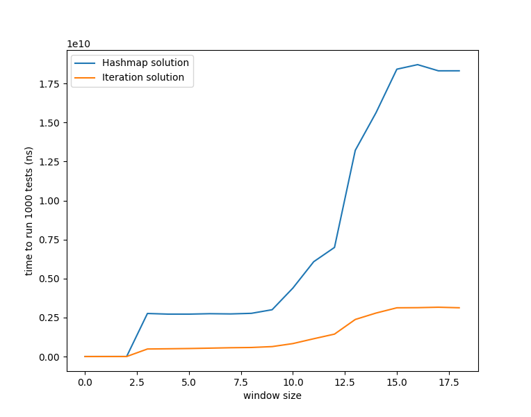

# aoc-2022

This is where I keep my answers for each day of [Advent of Code 2022](https://adventofcode.com/2022/)

Each folder is an independent Rust project. The program inputs are stored in example.txt for the samples given in the problem and input.txt for the full puzzle input.

Argument parsing is split into it's own file, parse_args.rs, for code clarity.

You can run each day with `cargo run`

You can specify which test to run with `cargo run [test num]`. Valid numbers are 1, 2, or 0 for both. 0 is the default.

You can test with the example input with `cargo run [test num] example`

Vague personal rules:
- Don't use external libs
- Try to make solution as fast as possible (playing to rust's strengths)
- Keep it functional when possible
- Prioritize aesthetics

I'm still learning rust, so the real goal is to just build competency in the
language. All of the above rules can be broken at my discretion.

Project structure inspired by [Tim Visee's excellent advent of code in 1 second
repo](https://github.com/timvisee/advent-of-code-2020).

## Day 6 optimizations
I first did day 6 with iteration, but (as a python dev) avoiding hashmaps was
eating at me. I decided to do a hashmap implementation, which looked a lot
nicer! And since I wasn't even necessarily fully populating the hashmap, i
decided to run a benchmark to see just how much slower it was. It couldn't be
that bad, right?

Yikes. I guess I'll avoid hashmaps!
